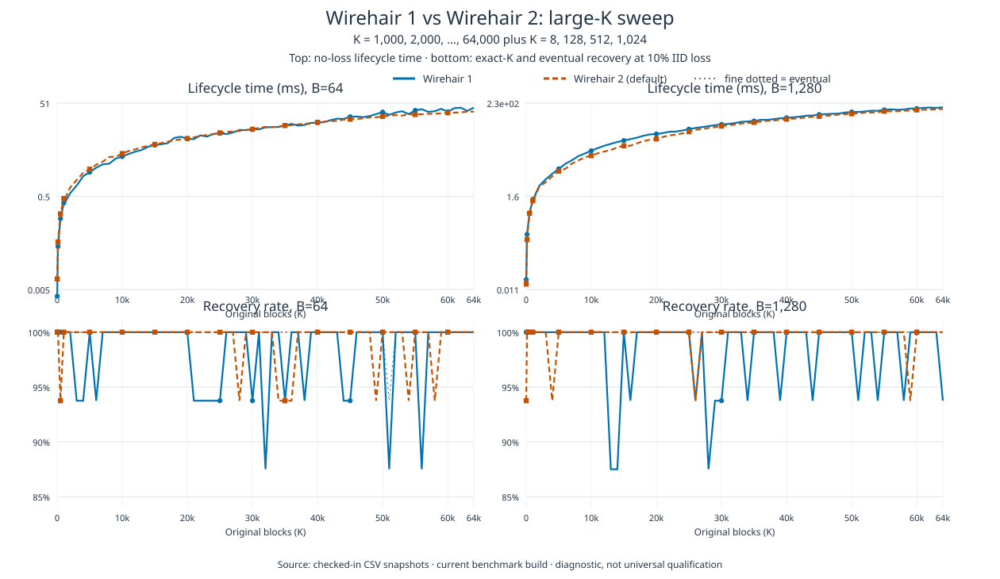

# WH1 vs WH2 timing snapshot

The [CSV](wh1-vs-wh2.csv) transcribes the rounded timings recorded on
2026-09-17 in Beads issue `wirehair-za1o`. It compares the legacy Wirehair 1
public C API with the default, pure-GF(256) Wirehair 2 public C API in the
same process. It does **not** substitute an opt-in WH2 profile such as K6.

The recorded workload is an all-systematic, no-loss lifecycle probe:
encoder creation, encoding the K original packets, decoder creation,
decode and recovery. The notes identify WH1's `wirehair_encoder_create_ex`
and WH2's `wirehair_v2_encoder_create` / `wirehair_v2_decoder_create` paths.
K is the number of original blocks, B is bytes per block, and the full-block
message size is K × B. The plotted metric is elapsed lifecycle time in
milliseconds, not separate encoder or decoder throughput. Lower is better.

| Blocks (K) | Block bytes (B) | Message bytes | WH1 (ms) | WH2 (ms) |
| ---: | ---: | ---: | ---: | ---: |
| 8 | 64 | 512 | 0.003 | 0.007 |
| 128 | 64 | 8,192 | 0.029 | 0.038 |
| 512 | 64 | 32,768 | 0.132 | 0.170 |
| 1024 | 64 | 65,536 | 0.334 | 0.395 |
| 8 | 1280 | 10,240 | 0.012 | 0.013 |
| 128 | 1280 | 163,840 | 0.163 | 0.112 |
| 512 | 1280 | 655,360 | 0.639 | 0.595 |
| 1024 | 1280 | 1,310,720 | 1.288 | 1.182 |

## Scope and limitations

These are one-host diagnostic observations, not a speed qualification gate.
The retained issue summary has no raw samples, confidence intervals, exact
source/build identity, CPU identity, repetition count, or complete timing-boundary
specification. Do not infer these from the current checkout or machine.
In particular, the 0.001 ms rounding is coarse at K=8. Both plot panels use
the same logarithmic axes; lines connect measured points only as visual guides
and are not measurements of intervening sizes.

WH2 took less time at B=1280 for K=128, 512, and 1024, but more time at all
four B=64 points and at K=8/B=1280. This snapshot does not establish that WH2
is always faster, and it says nothing about performance under loss, recovery
failure probability, or required repair overhead. It is separate from the
older WH1-only measurements in the root README, which use a different workload
and machine/build context.

## Regenerate the plots

From the repository root, using only Python 3.8+ and its standard library:

```sh
python3 docs/benchmarks/plot_wh1_vs_wh2.py
python3 docs/benchmarks/plot_wh1_vs_wh2.py --check
python3 -m unittest discover -s docs/benchmarks -p 'test_*.py'
```

This reproduces the SVG from the checked-in CSV; it does **not** rerun the
timing experiment. A future measurement refresh should retain the benchmark
source, exact build/host metadata, timing boundaries, and raw repeated samples
alongside its results. Keep the default WH2 and WH1 workloads matched, and
report lossy recovery measurements separately from this no-loss lifecycle.

## Large-K speed and recovery sweep

The large-K plot and its two source CSVs cover K = 8, 128, 512, 1,024 and
every 1,000-block point from K = 1,000 through the supported maximum K =
64,000, at B = 64 and B = 1,280. The speed CSV records five no-loss trials
per cell through the public WH1 and default public WH2 APIs; lifecycle time is
the matched create, encode, decode, recover, and free lifecycle measured by
the standalone public-API harness. The recovery CSV records 16 paired trials
per cell at 10% IID loss using a common delivered-ID schedule. A trial is
*exact-K* when it succeeds after exactly K delivered packets (zero repair
overhead); *eventual* means it succeeds within the bounded K+4 delivered-
packet horizon.

The producer was source commit `fc28cca`; the public-API harness was built
with GCC 13.3 and pinned to logical CPU 50 on an AMD Ryzen Threadripper PRO
9985WX host. The CSVs retain per-cell lifecycle and recovery counts, plus raw
trial output in the companion `*-trials.csv` files.



In aggregate over the 68 K points (1,088 paired trials per block size),
exact-K and eventual success were:

| Block bytes | WH1 exact-K | WH2 exact-K | WH1 eventual | WH2 eventual |
| ---: | ---: | ---: | ---: | ---: |
| 64 | 1,069 / 1,088 (98.25%) | 1,080 / 1,088 (99.26%) | 1,087 / 1,088 (99.91%) | 1,088 / 1,088 (100%) |
| 1,280 | 1,071 / 1,088 (98.44%) | 1,084 / 1,088 (99.63%) | 1,088 / 1,088 (100%) | 1,088 / 1,088 (100%) |

This supports lower repair overhead for WH2 over this particular current-code,
one-host, 10%-IID sample. It is an aggregate observation: WH2 is not better
in every individual K/B cell, 16 trials per cell are not an all-K reliability
qualification, and the bounded eventual result had one WH1 miss. The data
does not establish a universal failure rate, behavior under burst/adversarial
loss, or production promotion.

To regenerate the large-K plot from the checked-in snapshots:

```sh
python3 docs/benchmarks/plot_wh1_vs_wh2_large.py
python3 docs/benchmarks/plot_wh1_vs_wh2_large.py --check
```

The public-API producer can be rebuilt and rerun with:

```sh
g++ -std=c++11 -O2 -Wall -Wextra -Werror -DWIREHAIR_STATIC \
  -Iinclude docs/benchmarks/PublicApiSweep.cpp \
  build/wh2-profile/libwirehair.a -pthread -o /tmp/wh-public-sweep
python3 docs/benchmarks/run_public_api_sweep.py \
  --binary /tmp/wh-public-sweep --speed-trials 5 --recovery-trials 16 \
  --cpu 50 --output-dir docs/benchmarks
```
